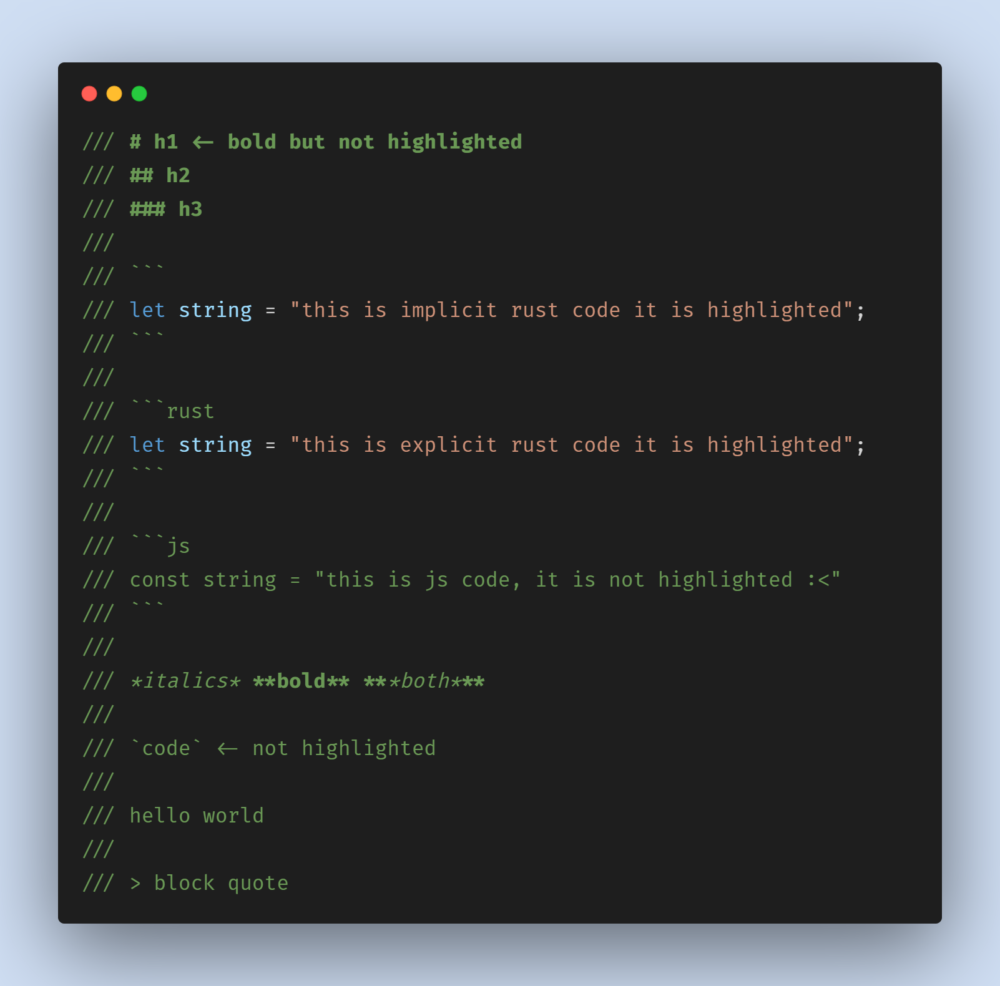
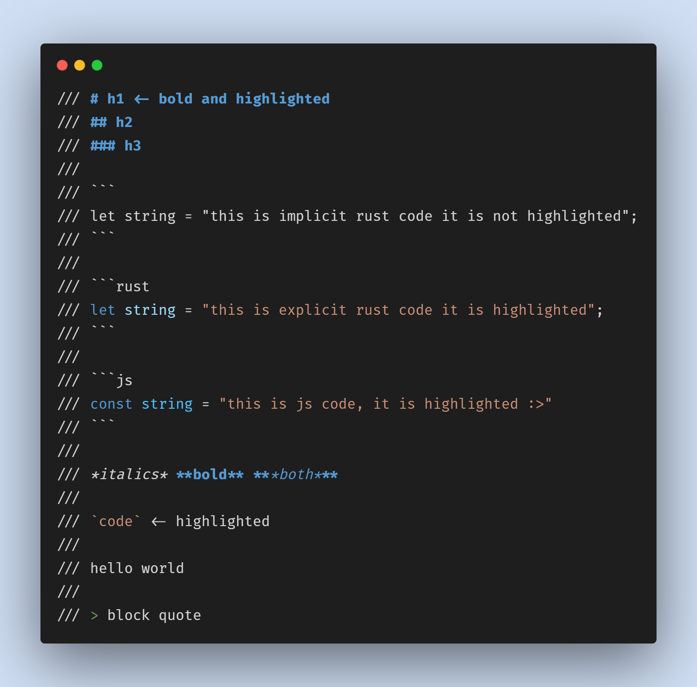

# vscode-rustdoc-markdown-highlighting

Treats rustdoc comments as markdown and highlights them accordingly.

## Known Issues

* Block comments don't work that well when formatted typically because they are parsed as list items:
    ```rust
    /**
     * <- parsed as a list item
     */
    ```
* This does not play well with rust-analyzer when using some themes

The differences between when rust-analyzer is enabled and not are due to its semantic highlighting, currently this difference is shown in the dark+ default theme which has semantic highlighting enabled.
This can be changed by themes but not really sure how to fix it in this extension :<

|                  with rust analyzer                  |                   without rust analyzer                    |
|:----------------------------------------------------:|:----------------------------------------------------------:|
|  |  |

## Release Notes
